# WhatIF Factory - Architecture Showcase

**Senior Solution Architect | Production-Grade AI Content Automation System**

[](https://www.youtube.com/@WhatIF_Factory_Official)
[](https://github.com/JuneBay/WhatIF-Factory-Showcase)

---

## 🎯 Project Overview

**WhatIF Factory** is a production-grade AI content automation pipeline that transforms a single topic into fully produced, localized content across 20 languages. Designed with **cost-aware architecture** and **human-in-the-loop** principles, it achieves **98.9% labor cost reduction** while maintaining production quality.

### Key Metrics
- **$0.48/video** production cost (optimized mode)
- **30-minute** production cycle (Shorts format)
- **24x productivity** increase (1 video/days → 24 videos/day)
- **20-country** multilingual automation (99.94% cost reduction)

---

## 🏗️ System Architecture

The system orchestrates multiple AI models into a cohesive, stateful pipeline with intentional human checkpoints at high-cost stages.

```mermaid
graph TB
    Start([Topic Input]) --> Script[Script Generation<br/>GPT-4o / Gemini 1.5 Pro]
    Script --> HITL1{Human Review<br/>Checkpoint}
    HITL1 -->|Approve| TTS[TTS Generation<br/>ElevenLabs Adam Voice]
    HITL1 -->|Regenerate| Script
    TTS --> SRT[SRT Subtitle Generation<br/>Whisper AI]
    SRT --> HITL2{Human Review<br/>Checkpoint}
    HITL2 -->|Approve| Images[Image Generation<br/>Flux 2.0 Pro]
    HITL2 -->|Regenerate| TTS
    Images --> HITL3{Human Review<br/>Checkpoint}
    HITL3 -->|Approve| Videos[Video Generation<br/>Runway Gen-4 / Veo 3.1]
    HITL3 -->|Regenerate| Images
    Videos --> HITL4{Human Review<br/>Checkpoint}
    HITL4 -->|Approve| Assembly[Video Assembly<br/>FFmpeg SRT-Driven Timing]
    HITL4 -->|Regenerate| Videos
    Assembly --> HITL5{Human Review<br/>Checkpoint}
    HITL5 -->|Approve| Translation[Multilingual Translation<br/>GPT-4o 20 Languages]
    HITL5 -->|Regenerate| Assembly
    Translation --> Upload[YouTube Upload<br/>API Metadata Sync]
    Upload --> End([Published Content])
    
    style HITL1 fill:#ffd700,stroke:#333,stroke-width:2px
    style HITL2 fill:#ffd700,stroke:#333,stroke-width:2px
    style HITL3 fill:#ffd700,stroke:#333,stroke-width:2px
    style HITL4 fill:#ffd700,stroke:#333,stroke-width:2px
    style HITL5 fill:#ffd700,stroke:#333,stroke-width:2px
    style Script fill:#4a90e2,stroke:#333,stroke-width:2px
    style TTS fill:#4a90e2,stroke:#333,stroke-width:2px
    style Images fill:#4a90e2,stroke:#333,stroke-width:2px
    style Videos fill:#4a90e2,stroke:#333,stroke-width:2px
    style Translation fill:#4a90e2,stroke:#333,stroke-width:2px
```



---

## 🎨 Core Design Principles

### 1. Human-in-the-Loop (HITL) Architecture
- **Intentional pauses** at high-cost stages (image/video generation, multilingual processing)
- **Granular rollback** system allowing selective regeneration without full restart
- **Quality control** checkpoints preventing wasted API usage

### 2. Cost-Aware Execution
- **Strategic AI model selection**: Free resources (Gemini, Veo, Adam voice) prioritized
- **API usage minimization**: Retry mechanisms with exponential backoff
- **Stateful pipeline**: Prevents duplicate API calls through persistent state

### 3. SRT-Driven Timing Architecture
- **Subtitle timelines** as single source of truth for synchronization
- **Automatic video assembly** eliminating manual editing
- **Narration, scenes, and subtitles** perfectly synchronized

### 4. Operational Sustainability
- **Error classification**: 11 error categories with automatic recovery suggestions
- **Comprehensive logging**: Detailed logs for debugging and cost tracking
- **Long-term maintainability**: Designed for repeated, production use

---

## 💻 Technical Implementation Highlights

### Pipeline Control & Exception Handling

The system implements robust error handling with automatic retry mechanisms and comprehensive error classification. See [`Core_Logic_Snippet.py`](./Core_Logic_Snippet.py) for detailed implementation.

**Key Features:**
- **Exponential backoff retry**: 2s → 4s → 8s intervals
- **Error classification**: 11 categories (Auth, RateLimit, Credits, Network, etc.)
- **User-friendly messages**: Technical details separated from user-facing guidance
- **Stateful recovery**: Pipeline can resume from any checkpoint

### Cost Optimization Strategy

| Stage | AI Service | Cost/Video | Optimization |
|-------|-----------|------------|--------------|
| Script | Gemini 1.5 Pro | $0.00 | Free LLM prioritized |
| TTS | ElevenLabs (Adam) | $0.00 | Premade voice (free) |
| Images | Flux 2.0 Pro | $0.605 | Minimum required count |
| Videos | Veo 3.1 | $0.00 | Free tier (5/day) |
| Translation | GPT-4o | $0.01 | Batch processing |
| **Total** | | **$0.615** | Optimized mode |

---

## 🔧 Solved Technical Challenges

### 1. Runway ML Credit System Separation
**Problem:** Web app credits ≠ API credits (separate systems)  
**Solution:** Identified `dev.runwayml.com` as API credit portal  
**Result:** 100% credit waste prevention

### 2. Veo Access Discovery
**Problem:** Veo Labs mistaken as independent site  
**Solution:** Discovered access through Gemini Advanced subscription  
**Result:** Free video generation (5/day) enabled

### 3. YouTube Multilingual Localization Conflict
**Problem:** `defaultLanguage` setting conflicts causing "requirement not met" errors  
**Solution:** Read-Modify-Write pattern + BCP-47 language code normalization  
**Result:** 100% success rate for 20-country uploads

### 4. Resolution Unification
**Problem:** Mixed resolutions (Gemini 2304×4096, Runway 720×1280) causing quality degradation  
**Solution:** FFmpeg scale+pad (letterbox) filter to unify at 1080×1920  
**Result:** Consistent high-quality output with aspect ratio preservation

### 5. SRT Timing Gap Handling
**Problem:** Video needed during subtitle gaps but processing was skipped  
**Solution:** Extend previous video until next subtitle start time  
**Result:** Natural video flow without manual editing

### 6. Human-in-the-Loop Error Handling
**Problem:** API failures causing full pipeline restart and cost waste  
**Solution:** Automatic retry (exponential backoff) + granular rollback + 11-category error classification  
**Result:** 90% reduction in process interruptions from transient errors

---

## 📊 Performance Metrics

| Metric | Before | After | Improvement |
|--------|--------|-------|-------------|
| **Labor Cost** | 90 person-hours/video | 1 person-hour/video | **98.9% reduction** |
| **Production Time** | 12-24 hours/video | 30 minutes/video | **92-96% reduction** |
| **Team Size** | 5 people | 1 person | **80% reduction** |
| **Production Cost** | Manual labor | $0.48/video | **99%+ reduction** |
| **Multilingual Expansion** | 1,800 person-hours (20 countries) | 1 person-hour | **99.94% reduction** |
| **Productivity** | 1 video/days | 24 videos/day | **24x increase** |

---

## 🚀 Real-World Usage

**WhatIF Factory** is actively used to operate real YouTube channels in daily production:

- **YouTube Channel**: [@WhatIF_Factory_Official](https://www.youtube.com/@WhatIF_Factory_Official)
- **Content Type**: YouTube Shorts (60-second format)
- **Languages**: 20 countries supported
- **Status**: Production-ready, actively maintained

In this environment:
- Failures have direct cost implications
- API usage must be carefully managed
- Consistency matters more than novelty

Design decisions were driven by these operational constraints, not by theoretical optimization.

---

## 🛠️ Technology Stack

### AI Models & APIs
- **LLMs**: GPT-4o, Gemini 1.5 Pro
- **Image Generation**: Flux 2.0 Pro
- **Video Generation**: Runway Gen-4 Turbo, Gemini Veo 3.1
- **TTS**: ElevenLabs (Adam voice)
- **STT**: Whisper AI (OpenAI)

### Core Technologies
- **Language**: Python 3.x
- **UI**: Streamlit
- **Media Processing**: FFmpeg
- **Automation**: Playwright (browser automation)
- **APIs**: YouTube Data API v3, OpenAI API, Google APIs

### Architecture Patterns
- **Stateful Pipelines**: Persistent project state
- **Event-Driven**: Checkpoint-based workflow
- **Error Recovery**: Automatic retry with exponential backoff
- **Cost Monitoring**: Real-time credit tracking

---

## 📁 Project Structure

```
WhatIF_Factory/
├── scripts/
│   ├── pipeline.py          # Main pipeline orchestration
│   └── app_v2.py            # Streamlit UI
├── services/
│   ├── openai_service.py    # GPT-4o integration
│   ├── flux_service.py       # Image generation
│   ├── runway_service.py     # Video generation
│   ├── elevenlabs_service.py # TTS
│   └── youtube_service.py    # YouTube API
├── utils/
│   ├── retry.py              # Retry decorators
│   ├── error_handler.py      # Error classification
│   └── logger.py             # Logging system
└── projects_v2/              # Persistent state storage
```

---

## 🎓 Architectural Insights

### Why This Architecture?

**Problem:** Most AI pipelines optimize for maximum automation, but real-world production requires operational sustainability.

**Solution:** Design for **controlled automation** where:
- AI accelerates execution
- Humans remain responsible for critical decisions
- Cost is transparent and manageable
- Failures are recoverable

### Key Architectural Decisions

1. **HITL Checkpoints**: Not a limitation, but a feature. Prevents expensive mistakes.
2. **Granular Rollback**: Enables rapid iteration without full restart.
3. **SRT-Driven Timing**: Eliminates manual synchronization work.
4. **Error Classification**: Enables intelligent recovery, not just retry.

---

## 📈 Business Impact

- **98.9% labor cost reduction**: 5-person team → 1-person operation
- **$0.48/video**: Optimized production cost
- **24x productivity**: From 1 video/days to 24 videos/day
- **20-country expansion**: Single-source content to global markets
- **99.94% cost reduction**: Multilingual localization automation

---

## 🔗 Related Resources

- **Showcase Repository**: [WhatIF-Factory-Showcase](https://github.com/JuneBay/WhatIF-Factory-Showcase)
- **Live Demo**: [@WhatIF_Factory_Official YouTube Channel](https://www.youtube.com/@WhatIF_Factory_Official)
- **Technical Details**: See [`Core_Logic_Snippet.py`](./Core_Logic_Snippet.py) for implementation highlights

---

## 💡 For Recruiters & Technical Managers

This showcase demonstrates:

✅ **Architecture Design**: Cost-aware, human-in-the-loop system design  
✅ **Problem Solving**: 6 major technical challenges solved  
✅ **Production Experience**: Real-world system actively in use  
✅ **Cost Optimization**: Strategic AI model selection and usage  
✅ **Error Handling**: Comprehensive retry and recovery mechanisms  
✅ **Scalability**: 24x productivity increase through automation  

**Not just code that compiles—systems that work reliably in production.**

---

<div align="center">

**Built with operational sustainability in mind, not theoretical perfection.**

*For architecture walkthroughs and deeper technical details, please contact: [jbjhun@gmail.com](mailto:jbjhun@gmail.com)*

</div>
